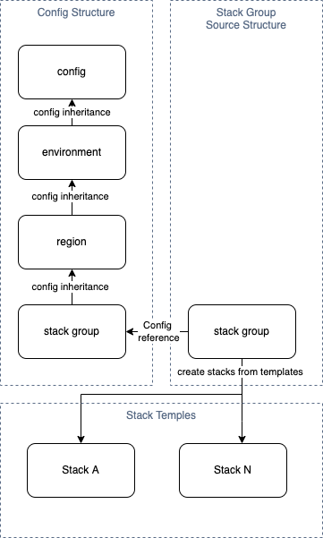

# CDK Organizer

CDK Organizer is a library motivated by the need to structure CDK projects in a way that is easy to maintain the stacks and the configuration per environment.

By default the CDK project structure is very simple and works well for small projects, but as the project grows it becomes harder to maintain without having multiple CDK start points.

With CDK Organizer the project structure is based on the environment, region and stack groups, each environment/region can have multiple groups, each group can have multiple stacks.

The stacks groups are also driven by configuration (YAML format), so you can have different configurations per environment/region for the same stack group.

More details about the project folder structure can be found here:

- [Python](reference/packages/python/#config-structure)
- [Typescript](reference/packages/typescript/core/#config-structure)

## Architecture

## Getting Started

- [Python](reference/packages/python/)
- [Typescript AWS CDK](reference/packages/typescript/aws/README.md)
- [Typescript CDK for Terraform](reference/packages/typescript/terraform/README.md)

## Examples

- [Python AWS CDK](https://github.com/cdk-organizer/cdk-organizer/tree/main/examples/python/aws-cdk)
- [Python CDK for Terraform](https://github.com/cdk-organizer/cdk-organizer/tree/main/examples/python/cdktf)
- [Typescript AWS CDK](https://github.com/cdk-organizer/cdk-organizer/tree/main/examples/typescript/aws-cdk)
- [Typescript CDK for Terraform](https://github.com/cdk-organizer/cdk-organizer/tree/main/examples/typescript/cdktf)
